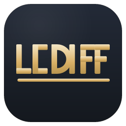
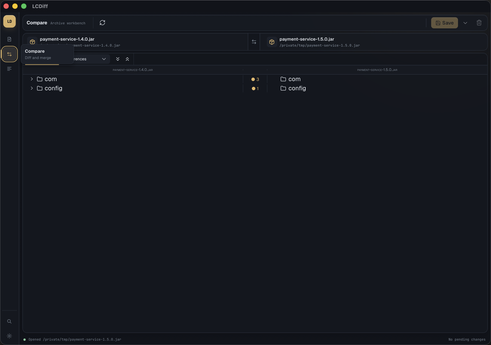
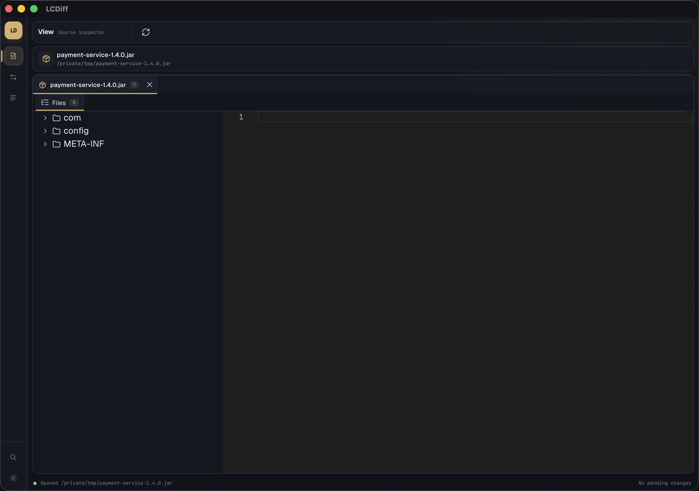

# LCDiff

<p align="center">
  
</p>

<p align="center">
  <strong>Inspect, compare, search, decompile, and safely merge Java archives.</strong>
</p>

<p align="center">
  A native desktop workbench for JAR, ZIP, WAR, EAR, folders, and free-text diffs.
  Decompiled Java stays read-only; saved merges always use the original entry bytes.
</p>

<p align="center">
  <a href="https://github.com/lyokha113/lcdiff/releases/latest">Download</a>
  · <a href="#features">Features</a>
  · <a href="#install">Install</a>
  · <a href="#quick-start">Quick start</a>
  · <a href="docs/DEVELOPMENT.md">Develop</a>
</p>

---

## See LCDiff in action

### Compare archives and folders

Load both sides, filter the tree by status, and open any matching entry as a
source, bytecode, text, metadata, or hex diff.



### Inspect one or many sources

View mode keeps multiple archives or folders open as source tabs and gives each
source its own entry workspace.



> Screenshots were captured directly from the LCDiff macOS desktop build using
> small local demo JARs.

## Features

| Area | What LCDiff provides |
| --- | --- |
| Three focused workspaces | **View** for inspection, **Compare** for archive diff/merge, and **Free text** for pasted or typed snippets. |
| Broad source support | Open JAR, ZIP, WAR, EAR, directories, and common text files from pickers, drag-and-drop, or the operating system. |
| Lazy archive browser | Navigate large archives without eagerly extracting everything; nested archives expand only when requested. |
| Structural comparison | CRC-based added, removed, changed, metadata-only, and identical states with aligned left/right trees and filters. |
| Java decompilation | Read-only Java through Vineflower, CFR, JD-Core, or JD-Core v0, with ASM Textifier bytecode as a separate view. |
| Monaco diff workspace | Source, bytecode, and text diffs with tabs, line navigation, whitespace controls, font settings, and compact layouts. |
| Binary inspection | Size, CRC, SHA-256, metadata, and hex previews when an entry is not safely renderable as text. |
| Deep search | Path, text, constant-pool, and optional decompiled-source search with cancellable background work and clickable results. |
| Safe staged merge | Copy selected entries or hunks between sides, review pending changes, then save atomically with optional backups. |
| Signed-JAR guard rails | Warnings before rewriting signed archives or discarding staged work. |
| Native desktop integration | File associations, Finder/Explorer open-with support, keyboard shortcuts, themes, and installed editor fonts. |
| In-app updates | Automatic checks plus signed native updater artifacts; GitHub Releases remains the fallback when native update is unavailable. |

### The safety contract

- Decompiled Java is a view, never a write path.
- Archive merges copy original entry bytes.
- Changes are staged before save.
- Saves are atomic and can preserve a `.bak` backup.
- Signed archives and destructive transitions require confirmation.

## Install

Download the newest build from
[GitHub Releases](https://github.com/lyokha113/lcdiff/releases/latest).

### macOS

Download `LCDiff-<version>-aarch64.dmg`, open it, and move LCDiff to
Applications.

LCDiff is currently distributed without Apple Developer ID notarization. If
macOS reports that the app is damaged, download the matching release helper and
run:

```bash
bash install-macos.sh
```

### Ubuntu

Choose the artifact matching the installed Ubuntu LTS release:

| Ubuntu | Artifact |
| --- | --- |
| 22.04 LTS | `ubuntu22.04-amd64` AppImage or `.deb` |
| 24.04 LTS | `ubuntu24.04-amd64` AppImage or `.deb` |

```bash
bash install-linux.sh LCDiff_<version>_ubuntu22.04_amd64.AppImage
bash install-linux.sh LCDiff_<version>_ubuntu22.04_amd64.deb
```

### Arch Linux

```bash
yay -S lcdiff
# or
paru -S lcdiff
```

### Windows

Download `LCDiff-<version>-windows-x64-setup.exe` on Windows 10 or 11.
Unsigned builds may display a SmartScreen warning until Authenticode signing is
configured.

## Automatic updates

LCDiff checks for a newer version at startup when automatic checks are enabled.
You can also open **Preferences → Misc → Updates → Check for updates**.

Release builds use per-platform signed updater metadata. If the current package
cannot complete a native update, LCDiff opens the matching GitHub Release so you
can install it manually.

## Quick start

### Inspect a source

1. Choose **View**.
2. Open a JAR, ZIP, WAR, EAR, folder, or text file.
3. Expand the tree and select an entry.
4. Switch between source, bytecode, text, metadata, and hex views when available.

### Compare and merge

1. Choose **Compare**.
2. Open the left and right sources.
3. Filter by differences and select an entry.
4. Inspect the diff, then stage an entry or text hunk in the intended direction.
5. Review pending changes and save the target.

### Compare pasted text

Choose **Free text**, edit both drafts, and confirm the comparison. Confirmed
results are read-only and kept in bounded local temporary history until cleared.

### Search

Open Search from the left rail or press `Cmd/Ctrl+F`. Start with fast path or
text search; use constant-pool or deep decompiled-source search only when the
surface result is not enough.

## Keyboard shortcuts

`Cmd` is used on macOS and `Ctrl` on Linux/Windows for command-style
shortcuts.

| Action | Shortcut |
| --- | --- |
| Open left/source file | `Cmd/Ctrl+O` |
| Open left/source directory | `Cmd/Ctrl+Alt+O` |
| Open right file | `Cmd/Ctrl+Shift+O` |
| Open right directory | `Cmd/Ctrl+Alt+Shift+O` |
| Search | `Cmd/Ctrl+F` |
| Save staged target | `Cmd/Ctrl+S` |
| Preferences | `Cmd/Ctrl+,` |
| Keyboard shortcuts | `Cmd/Ctrl+/` |
| Next / previous tab | `Ctrl+Tab` / `Ctrl+Shift+Tab` |
| Close active tab | `Cmd/Ctrl+W` |
| Copy entry to left / right | `Alt+[` / `Alt+]` |

The complete shortcut reference is available inside LCDiff.

## Platform notes

- Decompile and bytecode views use the bundled Java 17 sidecar.
- On Linux Wayland, Browse and direct path input are the most reliable open
  paths. If drag-and-drop misbehaves, try `GDK_BACKEND=x11 lcdiff`.
- AppImage installation does not require root; `.deb` installation does.
- Arch uses AUR rather than a GitHub Linux bundle.
- Windows installers are produced by GitHub-hosted Windows runners.

## Development

Architecture, setup, validation, packaging, and release operations live in:

- [Architecture](docs/ARCHITECTURE.md)
- [Development](docs/DEVELOPMENT.md)
- [macOS operations](docs/OPERATIONS_MACOS.md)
- [Platform validation](docs/PLATFORM_VALIDATION.md)
- [Releasing](docs/RELEASING.md)

The main local umbrella gate is:

```bash
npm run verify:all
```

Full release verification also includes the Rust workspace gates, JVM sidecar
smoke test, and a packaged desktop launch. See
[docs/DEVELOPMENT.md](docs/DEVELOPMENT.md) for exact commands.

## License

MIT
