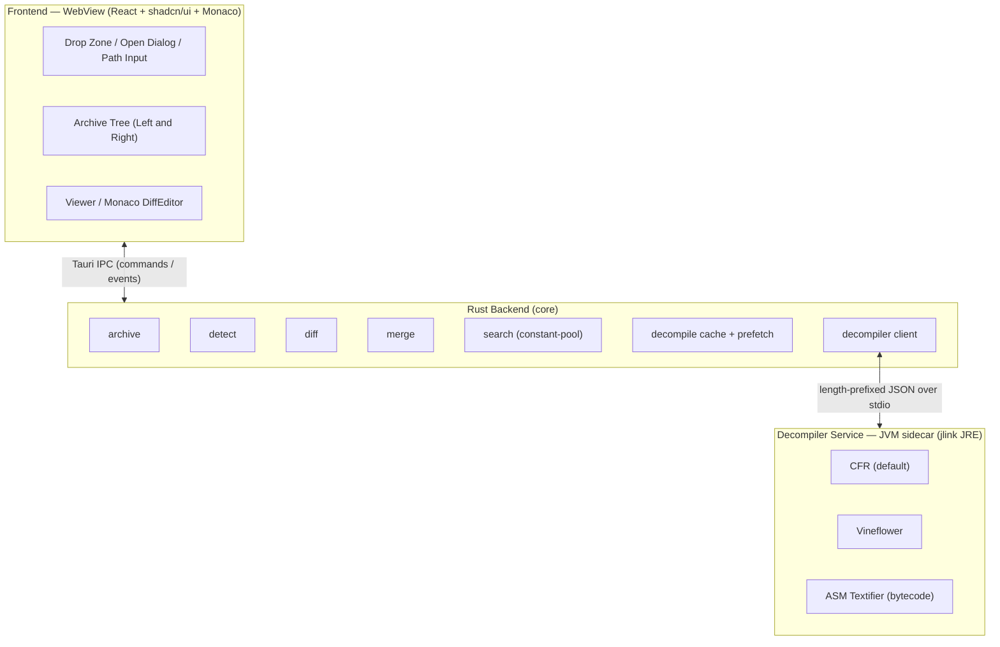
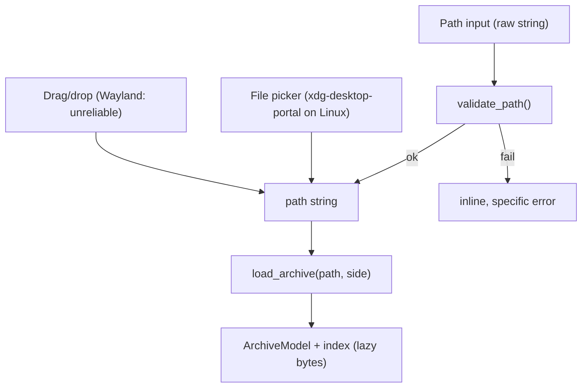
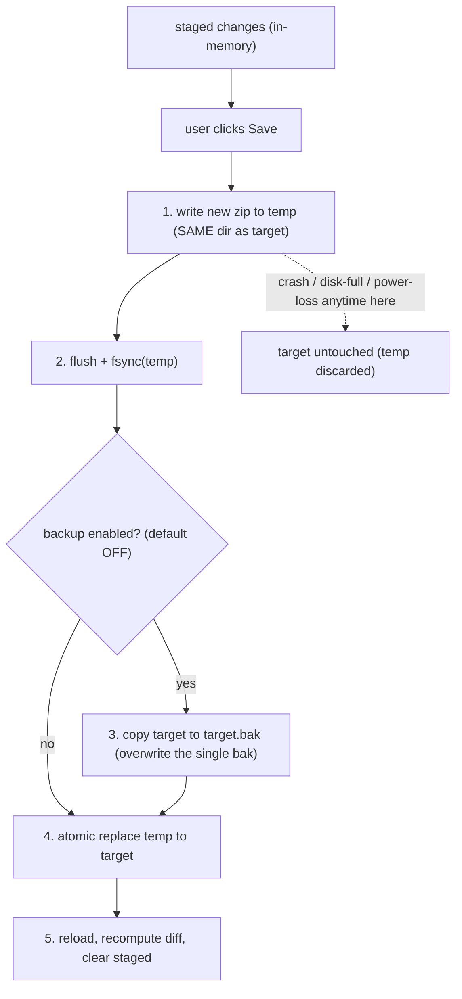
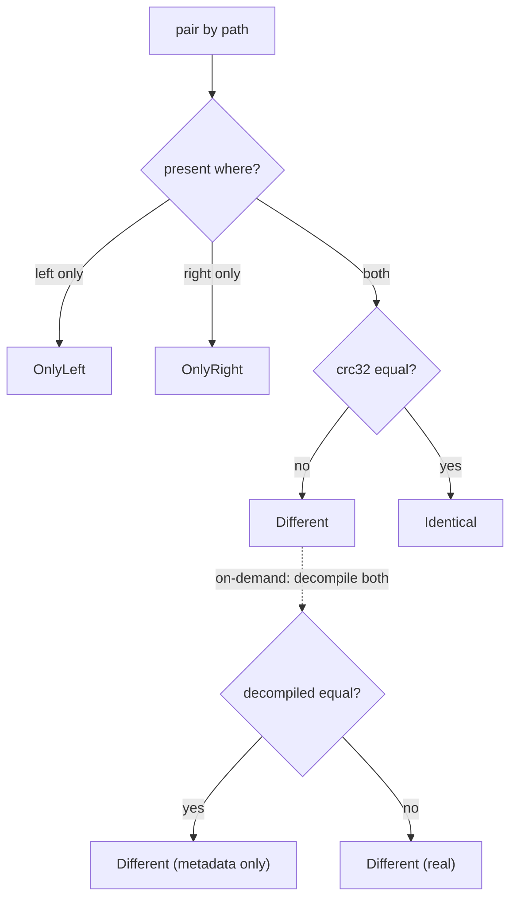
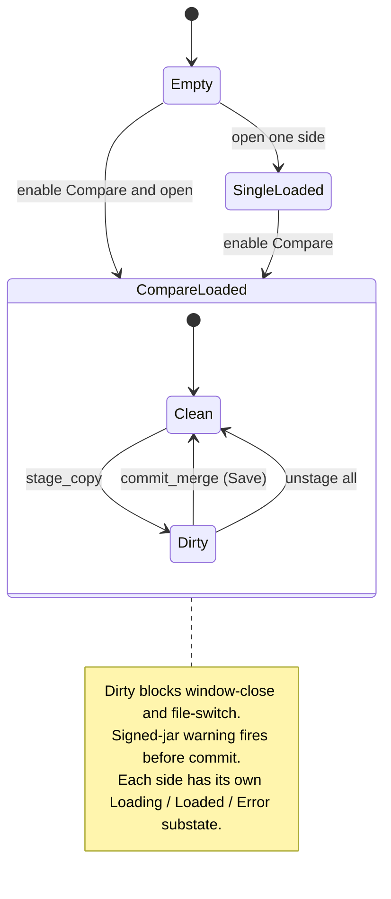
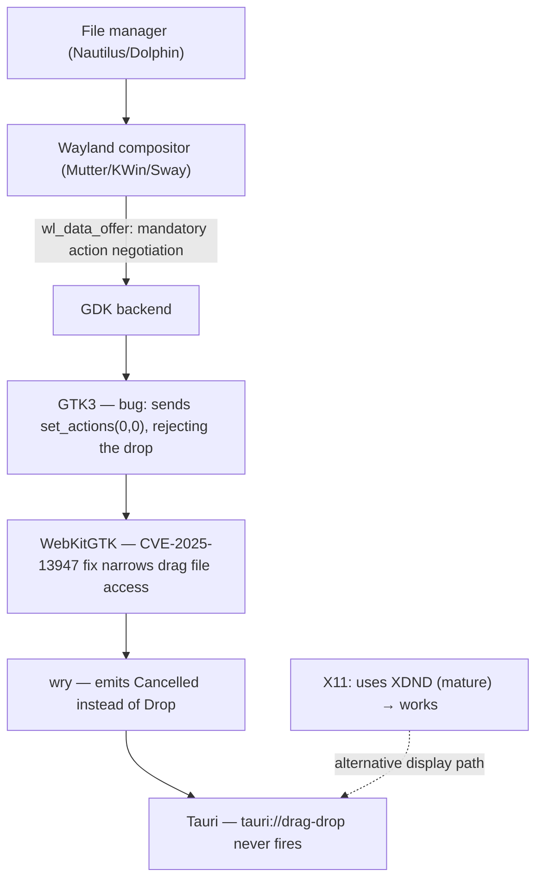

# SPEC — Java Decompiler + Archive Diff/Merge Tool

**Codename (tentative):** `jdiff` — "JD-GUI + Beyond Compare for JAR/ZIP"
**Status:** Draft SPEC v0.1 — MVP implemented (see `docs/JDIFF_COMPLETION_AUDIT.md`)
**Audience:** engineering / AI context document

> **Implementation status (2026-06-06):** M0–M4 are implemented locally. `cargo test --workspace`, `cargo clippy -D warnings`, `cargo fmt --check`, the JVM sidecar smoke test, and `npm run verify:all` (frontend build + release/packaging/CI/frontend-invariant/frontend-render/docs verifiers) all pass. `.github/workflows/ci.yml` and `.github/workflows/release.yml` now exist and are validated by the workflow invariant verifiers. Items in §16 and entries marked *deferred / phase 2 / nice-to-have* remain out of MVP, and the external platform gates (Windows/Linux display matrix, macOS Developer ID notarization, remote release runner) still require their target environments and credentials per `docs/PLATFORM_VALIDATION.md`.

---

## 1. Overview & Scope

### 1.1 Goals
A cross-platform desktop app that lets a user:

1. Open `.jar` / `.zip` files via drag/drop, native file picker, or a path-input field.
2. Auto-decompile Java `.class` entries to **read-only source** using **CFR** (default) or **Vineflower** (selectable). **Never recompile.**
3. View text-readable entries (`xml` / `json` / `txt` / `properties` / `yaml` ...) and fall back to a hex view for binary.
4. **Compare mode**: two side-by-side panels with tree-level diff + content-level diff.
5. **Merge**: copy an entry (class/file) directly between the two archives in either direction, Beyond-Compare style.

### 1.2 Non-goals
| Excluded | Reason |
|---|---|
| Recompile / bytecode editing | "No rebuild" requirement; decompiled source is view-only |
| Editing decompiled source and saving back into the jar | The **merge unit is the original bytecode**, not source (see §7) |
| APK / DEX (Android) | Would need JADX; deferred / out of scope |
| Obfuscation / deobfuscation, debugger | Out of scope |

> **General-case assumption (changeable):** `.jar` and `.zip` are handled as the **same ZIP container format**; only difference is jar typically has `META-INF/MANIFEST.MF` and may be signed. All archive logic shares one abstraction.

---

## 2. Tech Stack Decision

> **Decision: Tauri v2 + Rust backend. NOT a pure-Rust TUI.**
> Headline features require OS-level file drag/drop, mouse-driven panel-to-panel copy, and rich source-diff display. A terminal TUI cannot receive real OS drop events or do mouse drag/drop between panes. Tauri (WebView) provides native file-drop, a diff editor (Monaco), and a proper BC-style panel layout.

| Layer | Choice | Notes |
|---|---|---|
| Shell / window | **Tauri v2** | WebView per OS (WebKitGTK on Linux) |
| Backend | **Rust** | Archive I/O, type detection, diff, merge, sidecar management |
| Frontend | **React + shadcn/ui + Tailwind + Monaco `DiffEditor`** | shadcn gives Resizable split-pane, ContextMenu, Dialog, Tooltip out of the box; Monaco has a built-in side-by-side diff editor |
| Decompiler | **CFR (default) + Vineflower (selectable)** | Both are JVM artifacts (see §6) |
| JVM runtime | **jlink minimal JRE, bundled** (MVP) → GraalVM native-image (phase 2) | Bundled so users never install Java |

**Frontend rationale (optimized for a non-frontend dev):** shadcn/ui ships the exact primitives this app needs (resizable panels, context menus, dialogs) as copy-in components — no hand-rolled CSS. Monaco's `DiffEditor` renders Beyond-Compare-style diff from two strings with no custom diff-algorithm code. Pico CSS was rejected: it is classless and lacks the heavy components (tree, resizable split, diff) this tool needs. Trade-off: shadcn pins us to React + Tailwind; Monaco is heavier than CodeMirror but ships the diff editor for free — negligible next to a bundled JRE.

> **Verified reference:** Vineflower runs as `java -jar vineflower.jar <args> <source> <destination>` (source = jar/zip/folder/class) and is usable as a library via Maven `org.vineflower:vineflower`. Vineflower 1.9+ requires Java 11+, 1.11+ requires Java 17+. CFR is a single self-contained jar with fewer deps (preferred for the phase-2 native-image experiment). *CFR exact Java-version floor: verify at POC.*

---

## 3. High-Level Architecture



**Principle:** Rust backend is the source of truth for archives, entries, and bytes. The frontend is a pure view + intent emitter. The decompiler runs as a separate long-lived **sidecar** to avoid per-click JVM cold-starts.

---

## 4. Decisions Log

| # | Decision | Rationale |
|---|---|---|
| D1 | Tauri v2 + Rust (not TUI) | TUI cannot do OS file-drop or mouse panel-copy |
| D2 | Frontend = React + shadcn/ui + Tailwind + Monaco | Best ready-made primitives for a non-frontend dev |
| D3 | Decompiler = CFR default, Vineflower selectable | CFR reliable + light; show Vineflower as an option |
| D4 | Bundle a jlink JRE + decompiler as a stdio sidecar (Option A) | No system Java needed; output identical to official tools |
| D5 | Phase-2: explore GraalVM native-image sidecar | Single binary, no JVM; CFR first (lighter) |
| D6 | Merge writes **in-place** via **atomic replace** | User chose in-place; atomic prevents corruption |
| D7 | Auto-backup `.bak` default **OFF**, only **one** `.bak` kept | User choice; overwrite old `.bak`, no spam |
| D8 | Signed jar = **warning only**, no signature strip | User choice |
| D9 | No JADX / APK / DEX | User choice |
| D10 | Relative path resolves from **user home dir** | More predictable than app cwd *(assumption, overridable)* |
| D11 | Decompile lazily per-class + cache; pass containing jar as classpath | JD-GUI feel; resolves inner/sibling classes |
| D12 | **Merge unit = original bytecode bytes**, not decompiled source | Cannot reliably recompile; no rebuild |
| D13 | Tree-level diff uses **crc32 fast-path** (no decompress) | Scales to thousands of entries |
| D14 | In-app panel-to-panel copy via **buttons + context menu** (not OS DnD) | Avoids the Wayland DnD bug entirely |
| D15 | Three open paths: drag/drop, file picker, **path input** | Path input is display-server-independent fallback |
| D16 | Sidecar framing = **length-prefixed JSON** | Robust against newlines/large payloads |
| D17 | Bytecode view via **ASM Textifier** (recommended) | Pure library, no extra jlink module |
| D18 | **Per-arch** builds, not universal | Tauri won't merge sidecar archs; simpler with JRE |
| D19 | Linux: **AppImage** preferred (+ deb/rpm) | Bundles JRE cleanly; Flatpak deferred (sandbox friction) |
| D20 | **Self-host Monaco** via bundled `monaco-editor` + local Vite workers (`loader.config({ monaco })`), not the default CDN loader | Viewers must render offline in the packaged desktop app; CDN loader broke offline use and made headless render non-deterministic |

---

## 5. Open Mechanism (three input paths)

All three paths converge on one backend function. Reliability increases down the list — **path input never depends on the display server or a portal**, so a file can always be opened even when Wayland drag/drop and the portal picker both fail.



### 5.1 `validate_path` pipeline (for the path-input field)
| Step | Action | Why |
|---|---|---|
| 1 Normalize | trim whitespace; strip surrounding quotes (`"..."`, `'...'`) | users paste paths with quotes/escapes |
| 2 Expand | expand `~` → home; *(optional, marked)* env vars `$VAR` / `%VAR%` | convenience |
| 3 Resolve | relative → absolute (**relative resolves from home dir**, D10) | unambiguous |
| 4 Exists & type | must exist and be a file (not a dir) | fail early, clearly |
| 5 Readable | check read permission | avoid failing mid-parse |
| 6 Valid zip | check magic bytes `PK\x03\x04` | only load real zip/jar |
| 7 Load | call `archive::open` (same as picker/drop) | one pipeline |

Each failing step yields a **specific inline error** next to the field (e.g. "file not found", "not a valid zip/jar", "permission denied"), not a generic popup.

### 5.2 Per-side controls (compare mode)
Each side has independent state and its own Open controls (Browse button + path input + Open). Loading left and right via different methods is fine. Dropping onto a panel loads that side. Single mode shows one control set; switching to compare duplicates it. After load, each side shows its current path with easy change/reload.

### 5.3 Cross-platform path edge cases
Windows `C:\...`, drive letters, UNC `\\server\share`; Unix `/...`, `~`; strip surrounding quotes; trim trailing whitespace/newline; **follow symlinks** (load target); near-miss paths only error (no auto-suggest). *Nice-to-have (marked):* a recent-files dropdown.

---

## 6. Decompiler Integration (core risk)

Both CFR and Vineflower are **JVM artifacts**.

| Option | Description | Verdict |
|---|---|---|
| **A. Bundled JRE + jar sidecar** | jlink minimal JRE + decompiler jars; one long-lived process speaking stdio JSON | ✅ **MVP** (chosen, D4) |
| **B. GraalVM native-image** | Compile the service to one native binary per OS | ⏭ Phase 2 (CFR first; Vineflower/Fernflower reflection needs reachability metadata) |
| C. JNI in-process | Load libjvm into the Rust process | ❌ More complex, marginal gain |
| D. Pure-Rust decompiler | — | ❌ No production-grade equivalent |

**Roadmap:** MVP uses A. The service is a thin Java app (CFR + Vineflower + ASM on the classpath) exposing a stdio protocol. Phase 2 native-images the *same* service → drop-in replacement without protocol changes.

### 6.1 Sidecar lifecycle

```mermaid
sequenceDiagram
    participant FE as Frontend
    participant BE as Rust backend
    participant SC as JVM sidecar
    Note over BE,SC: spawned at app launch (warm start, async, non-blocking)
    FE->>BE: read_entry(side, "Bar.class")
    BE->>BE: detect = Class; cache lookup
    alt cache hit
        BE-->>FE: source
    else miss
        BE->>SC: {id, decompile, classpath=[jar], entry}
        SC-->>BE: {id, ok, source}
        BE->>BE: cache.put(key)
        BE-->>FE: source
        BE-)SC: prefetch siblings (low priority)
    end
```

- **Warm start:** spawn at launch; if spawn fails, mark *degraded* — text/binary viewing still works; surface the error only when a decompile is actually needed.
- **Supervisor:** on crash/hang, restart and re-issue the failed request once; if it fails again, surface an error (no infinite loop).

### 6.2 Protocol (data contract, not code)
Framing = **length-prefixed**: `[4-byte big-endian length][JSON payload]` (robust to newlines in source and large files).

```json
// Request
{ "id": "u1", "action": "decompile", "engine": "cfr",
  "classpath": ["/abs/left.jar"], "entry": "com/foo/Bar.class",
  "options": { } }

// Response OK
{ "id": "u1", "ok": true, "source": "package com.foo;\n...", "warnings": [] }

// Response Error
{ "id": "u1", "ok": false, "errorKind": "ClassFormatError|NotFound|Timeout|EngineError",
  "message": "...", "fallback": "bytecode|none" }

// Control
{ "id": "u2", "action": "cancel", "target": "u1" }
{ "id": "u3", "action": "ping" }
{ "id": "u4", "action": "disassemble", "classpath": [...], "entry": "..." }
```

### 6.3 Concurrency
Serialize requests within one JVM (queue) for MVP — engine instances may not be thread-safe and the UI views one class at a time. `id` correlation enables future multiplexing. Prefetch shares the queue at low priority; user clicks always preempt. Cancellation drops pending prefetch results. *(Phase-2: a JVM worker pool if latency demands — marked.)*

### 6.4 Engine options abstraction
Define an abstract `DecompileOptions`, then translate to per-engine flags (CFR and Vineflower differ).

| Abstract option | Vineflower *(verified from official usage docs)* | CFR |
|---|---|---|
| decode enums | yes | *verify at POC* |
| decompile generics | yes | *verify* |
| inner classes | yes | *verify* |
| switch expressions | yes (modern Java) | *verify* |
| indent string | yes (spaces/tabs per indent) | *verify* |
| show line numbers | line-mapping support | *verify* |

> Vineflower's CLI documents decompiling enums, generics, inner classes, switch expressions, and a configurable indent string. CFR flag names are **not fabricated here** — confirm at the S3 spike from real source.

### 6.5 Timeout / watchdog
Each request carries a Rust-side timeout (e.g. 30 s, configurable). On expiry → `Timeout` + supervisor kills/restarts the process (it may be stuck). Do **not** rely on engine-side timeouts (Vineflower's per-method time-limit option is deprecated). JVM tuning: jlink minimal modules; sensible `-Xmx`; macOS `.app` bundle path resolution for the JRE.

---

## 7. `archive` + `merge`

### 7.1 ZIP essentials
A zip/jar = sequence of *local header + data* per entry, then a **Central Directory** (the authoritative index: path, size, **crc32**, compression, offset), then **EOCD**.

### 7.2 `archive` design
| Decision | Reason |
|---|---|
| Lazy-read entry bytes; keep only metadata in memory | thousands of classes; avoid loading all into RAM |
| Read crc32 from Central Directory (free, no decompress) | fast tree-level diff |
| sha256 only on demand | crc32 + size is enough for the fast path |

**Fast equality via crc32:** the zip crc32 is the checksum of *uncompressed* data, so equal uncompressed content always yields equal crc32 regardless of compression method/level. Therefore:
- crc32 differs → definitely **Different** (no decompress).
- crc32 + uncompressed size equal → **Identical** (optionally verify sha256 in a "paranoid" mode). *(crc32 is 32-bit; theoretical collisions exist — sha256 verify is the opt-in safeguard. Marked.)*

**Detected metadata:** `signed?` (`META-INF/*.SF` + `*.RSA/*.DSA/*.EC` + manifest digests), `multiRelease?` (`META-INF/versions/<N>/...`), `zip64?` (*verify zip crate support at POC*).

### 7.3 `merge` semantics
Copy = the **original uncompressed bytes** of the source `.class` entry, re-compressed into the target (never the decompiled source). Re-compressing rather than raw-copying compressed bytes is safest (no compression-compatibility assumptions); class files are small. Raw-copy is a later optimization (marked).

Because zip cannot be edited truly in place (adding/replacing an entry shifts later offsets and breaks the Central Directory), **in-place = rewrite to temp + atomic-rename onto the original path**.

### 7.4 Staged-changes model
Merge does **not** write immediately. Arrow (`←`/`→`) copies accumulate as in-memory **staged** changes (tree shows "pending" badges). Only **Save** triggers a single rewrite for **all** staged changes (batch → one rewrite for N changes). Matches Beyond Compare's mental model and the explicit-commit principle for destructive actions.

### 7.5 Commit flow (atomic replace + single `.bak`)



- Temp **must** be in the same directory/filesystem as the target so the rename is atomic (cross-fs rename degrades to copy+delete, losing atomicity).
- `fsync` before rename for durability.
- Backup is a **copy** before the rename, overwriting the old `.bak` → automatically satisfies "single bak".
- Atomic replace is the only "switch flip": POSIX `rename(2)` is atomic and replaces an existing file; **Windows** `std::fs::rename` fails if the destination exists → use `ReplaceFileW` / `MoveFileExW(MOVEFILE_REPLACE_EXISTING)` via a crate abstraction *(verify at POC, D6/S4)*.
- If anything fails before the rename, the original target is untouched.

### 7.6 Signed jar (warning only, D8)
On commit affecting a class in a signed jar, show a **non-blocking** warning: "This JAR is signed. Modifying it will invalidate the signature; it may fail where signature verification is enforced." User confirms → proceed. **Do not strip** `META-INF/*.SF/*.RSA` (kept, though now stale). Warn **once per Save**, with an optional "don't ask again this session for this file" checkbox (marked).

### 7.7 Edge cases
| Case | Handling |
|---|---|
| Directory entry (`path/`) | preserved on rewrite |
| Multi-release (`META-INF/versions/N/...`) | explicit path → copy to exact path |
| `MANIFEST.MF` | not auto-edited on class copy |
| Path normalization (`\`, leading `/`, dupes) | normalize on index |
| Target modified externally since open (mtime/size) | detect before commit → warn |
| Target read-only / no permission | error **before** starting rewrite |
| Disk full during temp write | temp discarded, target intact |
| Encrypted entry (rare in jars) | cannot copy → skip / error |
| Zip64 | verify crate support (marked) |

---

## 8. `diff`

Two tiers — do not conflate them.

### 8.1 Tree-level (structural)
Pair by normalized full path. Status is **always decided by bytes (crc32)**, never by decompiled source.



**Alignment (BC-style):** the two trees align by path — an `OnlyLeft` row leaves a gap on the right at the same line, and vice versa; synchronized scrolling. **Filter view:** `Show all` / `Differences only` / `Only-left` / `Only-right` (differences-only is the most-used).

### 8.2 Content-level
| kind | diff on | note |
|---|---|---|
| Class | **decompiled source** of both sides | never diff raw bytes — meaningless to a human |
| Text | text content directly | per detected encoding |
| Binary | hash + size only; no content diff | show "binary differs"; optional hex side-by-side |

Rendering: feed both strings into Monaco `DiffEditor` (it runs the diff and renders side-by-side — no custom diff code). Offer `ignoreTrimWhitespace`.

### 8.3 "metadata-only" nuance
Two classes can differ in bytes (crc32 differs → `Different`) yet decompile to identical source (differing debug line numbers, `LocalVariableTable`, constant-pool order, or javac version). The tertiary status `Different (metadata only)` distinguishes "build/debug difference" from "real logic difference". It requires decompiling both sides and comparing — **on-demand only** (e.g. when the pair is opened, or lazily in differences-only mode), never for thousands of entries. Marked as a post-MVP feature.

### 8.4 Rename/move detection (nice-to-have, marked)
A class moved to another package shows as `OnlyLeft` + `OnlyRight` by default. Optionally match `OnlyLeft`↔`OnlyRight` pairs with equal crc32 → `Moved/Renamed`. Out of MVP.

---

## 9. Search (three tiers)

| Tier | Searches | Cost | JVM/decompile? |
|---|---|---|---|
| **T1 Within-file** | current open file | ~0 | no |
| **T2 Symbol/name** | entry paths + class/method/field names + string literals | cheap | **no** (reads constant pool) |
| **T3 Deep source** | full decompiled source | very expensive | yes |

- **T1:** Monaco built-in find (regex, case, highlight). No backend. Applies to source, text, and bytecode tabs.
- **T2 (key design):** a class file's **constant pool** already contains, as text, class/method/field names and **every string literal** (`CONSTANT_Utf8`). Parsing the constant pool (cheap, no decompile, no JVM) answers most real search needs — "which class has this string", "where is method X" — **instantly across a thousand-class jar**. Implemented with a **Rust class-file reader** (read up to the constant pool only) so search never contends with the decompile queue. *(Crate vs hand-roll: decide at POC; the format is stable and simple.)* Plus an instant **entry-name filter** in the tree (glob/regex), like JD-GUI's "Open Type".
- **T3:** opt-in only ("Deep search"), runs in background via the sidecar queue at low priority with progress + cancel, reuses the decompile cache, and streams matches as they arrive.

**Compare mode:** scope = Left / Right / Both; results tag the side; clicking a result jumps + highlights (and opens the diff if it is a `Different` pair). **Result list:** `entry path · match kind · (line for T1/T3)`.

---

## 10. Bytecode View Tab

A **Bytecode** tab beside **Source** for each class. Value: verify the `Different (metadata only)` case; fallback when decompilation fails; reverse-engineering cross-reference.

| Method | Description | Verdict |
|---|---|---|
| **ASM `Textifier`** | `TraceClassVisitor` + `Textifier` in the sidecar | ✅ pure library, deterministic, no extra jlink module |
| javap via `ToolProvider` | include `jdk.jdeps` in jlink, call `ToolProvider.findFirst("javap")` (public API since Java 9, no internal API) | alt; bloats jlink, output tied to JDK version |

Integration: lazy (compute on tab open), cached like decompile with `mode=bytecode` in the key, sidecar `disassemble` action. Compare mode: optional bytecode diff side-by-side (Monaco), especially useful for metadata-only diffs. Marked as enhancement.

---

## 11. UI / UX

### 11.1 Modes
- **Single:** one tree + one viewer (JD-GUI).
- **Compare:** two synchronized trees + a diff viewer.

### 11.2 Compare layout
```
Toolbar: [Open L] [Open R] [Engine: CFR v] [Options] [Search] [Mode: Compare]
+-------------------- LEFT --------------------+------------------- RIGHT -------------------+
| [Browse] [path input............] [Open]     | [Browse] [path input............] [Open]    |
| current: /abs/left.jar                       | current: /abs/right.jar                     |
+----------------------------------------------+---------------------------------------------+
| tree (aligned by path, status colors)        | tree (aligned by path, status colors)       |
|   Bar.class      [Different] ->               | <- Bar.class      [Different]                |
|   Only.class     [OnlyLeft]  ->               |    (gap)                                     |
+----------------------------------------------+---------------------------------------------+
| Diff editor (side-by-side): decompiled Left  |  decompiled Right                            |
+----------------------------------------------------------------------------------------------+
```
Center gutter has `←` / `→` arrows to copy entries (the merge action). Status colors: `OnlyLeft`, `OnlyRight`, `Identical`, `Different`. The diff viewer shows **decompiled-source** diff, but the copy unit is **original bytecode**.

### 11.3 Viewers
| kind | viewer |
|---|---|
| Class | decompiled source (Monaco, Java, read-only) + **Bytecode** tab |
| Text | Monaco by detected language |
| Binary | hex view + "no preview" |

### 11.4 UI state machine



---

## 12. Cross-Platform Concerns

### 12.1 Two distinct "drag/drop" operations
Only the first is affected by the Wayland bug.

| Operation | Description | Wayland bug? |
|---|---|---|
| (a) OS → app file drop | drag a `.jar` from the file manager onto the window | ⚠️ **yes** |
| (b) in-app panel → panel | copy a class from left tree to right (merge) | ✅ **no** — done via buttons/context-menu (D14) |

So the real blast radius is narrow: only "drop a jar onto the window" on Linux Wayland. Everything else has a reliable path.

### 12.2 Why (a) breaks on Wayland — the layer chain



Root cause is at the GTK/WebKitGTK layer, not Tauri:
1. Wayland adds a mandatory copy/move/ask **action negotiation** (`wl_data_offer`) that X11's XDND does not. X11 works; Wayland is where the bug lives.
2. GTK negotiates incorrectly: when the drop target accepts only `copy` but the compositor prefers `move`, GTK4 sends `set_actions(0,0)`, rejecting the whole drop instead of negotiating copy — described upstream as a GTK `wl_data_offer` negotiation bug.
3. Result at wry: a `Cancelled` event instead of `Drop` (confirmed Wayland-specific; switching to Xorg fixes it), so `tauri://drag-drop` never fires.

Compounding factor (moving target): WebKitGTK 2.50.3 (Dec 2025) shipped a broad workaround for CVE-2025-13947 that disabled file access for drags — pin the WebKitGTK version and re-test drag/drop after each update. Trajectory: the ecosystem is moving to GTK4 + WebKitGTK 6.0 for better Wayland support; Tauri v2 is still on GTK3 + webkit2gtk-4.1 (the buggy stack). *(Timeline is not officially committed — this is an assessment, not a guarantee.)*

### 12.3 Mitigations (in priority order)
| # | Mitigation | Trade-off |
|---|---|---|
| 1 | Menu/Browse Open is the primary path; drag/drop is enhancement only | none |
| 2 | In-app merge via buttons/context-menu (D14) | none |
| 3 | XWayland fallback: detect Wayland, set `GDK_BACKEND=x11` via a launcher | loses native-Wayland benefits; some compositors lack XWayland |
| 4 | Runtime-detect Wayland → subtle hint that drop may be limited, use Open | small UI logic |
| 5 | Pin WebKitGTK version; re-test drop after each update | maintenance |
| 6 | **Path input** (§5) — display-server- and portal-independent | none — guarantees a file can always be opened |

With paths #1, #2, #6, even on the worst Wayland setup the user can always open a file; the Wayland risk degrades to "less convenient", not "blocking".

### 12.4 macOS / Windows
macOS and Windows file-drop work natively. Distribution requires signing (see §14).

---

## 13. Data Model (conceptual)

```
ArchiveModel { id, path, hash, signed, multiRelease, entries: [Entry] }
Entry        { path, kind: Class|Text|Binary|Dir, uncompressedSize, crc32, sha256?, compression }
DecompileKey { archiveHash, entryPath, engine, optionsHash, engineVersion, mode: source|bytecode }
ComparePair  { left: Entry?, right: Entry?, status }
PairStatus   = OnlyLeft | OnlyRight | Identical | Different | DifferentMetadataOnly
StagedChange { target: L|R, op: Add|Overwrite, entryPath, sourceArchiveId }
CommitResult { ok, rewrittenPath, backupPath?, signatureInvalidated }
```

### 13.1 IPC surface
**Commands (request/response):** `open_archive(path, side)`, `validate_path(raw)`, `read_entry(side, entryPath)`, `set_engine("cfr"|"vineflower")`, `compute_diff()`, `stage_copy(from, entryPath, to)`, `unstage(stageId)`, `commit_merge(targetSide)`, `disassemble(side, entryPath)`, `search(scope, query, tier)`.
**Events (push):** `progress`, `decompile_done`, `archive_changed_externally`, `sidecar_state`, `error`, `search_result`.

### 13.2 Backend concurrency
State lives in the backend (one actor/Mutex); the frontend is a view. Long ops (open large jar, commit, decompile, deep search) run async (tokio), never blocking the UI, emit `progress`, and honor cancellation tokens.

### 13.3 Decompile cache & prefetch
Key = `(archiveHash, entryPath, engine, optionsHash, engineVersion, mode)`. `archiveHash` changing after a save **auto-invalidates** stale source. LRU with a memory cap (e.g. 128 MB, configurable). Prefetch siblings/visible neighbors at low priority; cancel on navigation; in compare mode, prefetch both sides of a selected `Different` pair. *Disk cache: in-memory only for MVP; optional persistence later, keyed including `engineVersion`.*

---

## 14. Packaging & Code-Signing

> **Cross-cutting complication:** bundling a **JRE** (jlink) adds many child executables/dylibs, which makes signing/notarization harder than a plain Tauri app.

### 14.1 Bundle targets
| OS | Targets | Notes |
|---|---|---|
| macOS | `.app` + `.dmg` | per-arch (§14.4) |
| Windows | NSIS `.exe` (and/or `.msi`) | |
| Linux | **AppImage** (preferred) + `.deb` / `.rpm` | AppImage bundles the JRE cleanly; Flatpak deferred (§14.5) |

### 14.2 macOS (hardest with a JRE)
Apps distributed outside the App Store must be both code-signed and notarized (else macOS warns or refuses to open); requires a paid Apple Developer account ($99/yr). Notarization is required with a Developer ID Application certificate; a free account cannot notarize (app stays "not verified"). Ad-hoc signing is possible (useful on Apple Silicon, still requires the user to whitelist in Privacy & Security).

**Entitlements (more than a normal app — both WebView and JVM JIT):**
- `com.apple.security.cs.allow-jit` and `com.apple.security.cs.allow-unsigned-executable-memory` — required for the WebView, and also cover the **JVM JIT**.
- `com.apple.security.cs.disable-library-validation` — the JRE loads dylibs not signed by us (the minimum for sidecar/shell processes to pass Gatekeeper).

**Bundled-JRE pitfall (real risk):** notarization requires **every** mach-O binary in the bundle to be signed with hardened runtime; a JRE has dozens. There are reported codesigning/notarization failures specifically with sidecar/ExternalBin on macOS — exactly our case. Sign **inside-out** (sign each JRE child binary first, then the outer `.app`); do **not** rely on `codesign --deep` (Apple-discouraged). This is a dedicated M4 task to test early.

### 14.3 Windows
Tauri signs via `bundle > windows > signCommand` (signtool or any signer). EV vs OV: OV still triggers SmartScreen until reputation builds; EV (HSM/token or Azure Key Vault) passes immediately *(general knowledge, marked — budget-dependent)*. JRE child binaries are less strict than macOS; signing the installer is the minimum.

### 14.4 Per-arch (not universal)
Tauri only handles the Rust binary and **won't** build a universal sidecar; with a JRE that means two runtimes. **Decision (D18):** ship per-arch installers (macOS `aarch64` + `x86_64` separately).

### 14.5 Linux
AppImage bundles the JRE + WebKitGTK deps in one file (no system Java) — preferred. `.deb`/`.rpm` bundle the JRE and declare the WebKitGTK dependency (`webkit2gtk-4.1`). **Flatpak (deferred):** the sandbox limits opening arbitrary files by path (needs `--filesystem=host` or portals), which conflicts with the path-input feature — post-MVP, marked.

### 14.6 Cost of bundling the JRE (accepted trade-off)
Installer size grows (~40–60 MB per OS/arch), notarization takes longer (larger upload), and CI must build per-OS + per-arch and sign/notarize automatically (e.g. GitHub Actions across macOS/Windows/Linux runners).

---

## 15. Milestones

| Milestone | Content | Goal |
|---|---|---|
| **M0 Spike (de-risk)** | (1) Tauri file-drop across Wayland/X11/mac/Win; (2) JVM sidecar bundle+spawn on 3 OS; (3) CFR & Vineflower return source; (4) atomic rewrite + signed-jar behavior | prove the 4 biggest risks |
| **M1 MVP Single** | open jar, tree, lazy decompile, text/hex viewers, engine switch | usable JD-GUI |
| **M2 Compare** | two panels, tree diff (status colors), content diff editor | read & compare |
| **M3 Merge** | copy entry L↔R (bytecode), staged + atomic save + single `.bak`, signed warning | BC-style merge |
| **M4 Polish/Dist** | search (T1–T3), bytecode tab, prefetch, native-image sidecar (POC), per-OS sign/notarize/package | release |

### 15.1 M0 Spike plan
| ID | Risk | Approach | Pass criteria |
|---|---|---|---|
| **S1** | Wayland/X11 file-drop + Open | minimal Tauri app on the compositor matrix below | record whether drop fires; **Open dialog + path input always open a file** on every case |
| **S2** | JVM sidecar bundle & spawn (3 OS) | jlink JRE in Tauri resources; long-lived process; stdio JSON | resolve bundled JRE path on mac/Win/Linux; round-trip one request; clean start/kill/restart |
| **S3** | Decompiler returns correct source | CFR + Vineflower decompile one class, **passing the jar as classpath** | correct source; inner/anonymous classes resolve; measure latency/class; confirm real library APIs |
| **S4** | Atomic rewrite + signed jar | rewrite a jar (overwrite one class) to temp → atomic rename; kill mid-write | new jar loads (`java -jar`/classloader); mid-write kill leaves target intact; signed jar correctly invalid; **Windows `ReplaceFileW` path** works |

**S1 compositor matrix:** GNOME/Mutter (Wayland + X11), KDE/KWin (Wayland + X11), Sway/wlroots (Wayland). For each: does `tauri://drag-drop` fire, and does the XWayland fallback recover it.

---

## 16. Open POC Items (to verify, not assumed)
1. CFR library API + exact option flag names (S3).
2. Rust `zip` crate: Zip64 support + rewrite preserving metadata (S4).
3. Windows atomic-replace crate (`ReplaceFileW` / `MoveFileExW`) (S4).
4. CFR / Vineflower exact library entry-points for in-process calls (S3).
5. Rust constant-pool parser for symbol search (crate vs hand-roll).
6. Bytecode: ASM Textifier vs javap-`ToolProvider` (decide by output).
7. macOS: inside-out signing of JRE child binaries + sidecar notarization (M4, test early).

---

*End of SPEC v0.1.*
